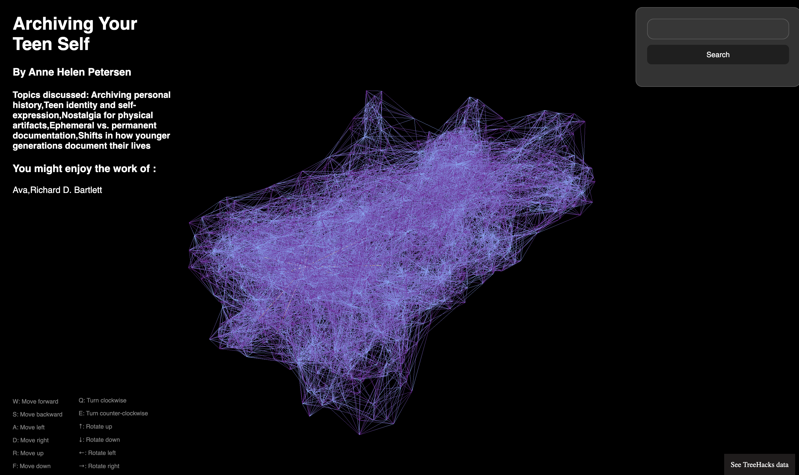

# Reader - 3D Semantic Graph of a subset of Substack blogs



You can view it here - 

I built this project as an experiment and as something that could lead up to something I want. Essentially when I read blogs or posts on the internet and I really like them, I want to see more at that time. Yes, I know, I can follow the author and all but I want to know more authors writing about this stuff at that point in time.

This experiment was born out of that. And since I'm doing a lot of ML stuff, I decided to experiment with topic modelling. You can check it all out on my devlog - [itskeane.info/blog/reader](https://www.itskeane.info/blog/reader)

## Building

This process occurs in 4 steps

1. Acquiring data by scraping Substack
2. Cleaning the data by cleaning all the markdown files
3. Topic modelling on the data
4. Embedding the topics and other metadata for each post
5. Building the graph by querying the vector database
6. Reading the graph and bundling it.

For steps 1-5, refer to the [HOW_TO.md](./pipeline/HOW_TO.md) for details on how to acquire the data.

### 6. Reading the graph

This was mostly borrowed from [Nexus](https://github.com/freeman-jiang/nexus). I changed the stuff for accessing the nodes and how the panel displayed. When you finish steps 1-5, you should have a graphData.json file. This must be moved to the `frontend` folder.

Then you can run the following the `frontend` folder

```bash
npm i
npm run dev
```

This will build the `bundle.js` file and then you can view `index.html`. Any changes to index.js is then reflected.

## Running

To run this, you need to follow the steps above and then navigate to the frontend/ directory and then  

```bash
npm i
npm run start
```

This will generate a `bundle.js` and then you can open index.html in your favourite browser :).

__WARNING: This is no way meant to be production ready. I cooked this up in a weekend. Please don't take it too seriously__

## References

The code is majorly forked from [Nexus](https://github.com/freeman-jiang/nexus).

- I made changes to the frontend for rendering.
- I made changes to how the data is collected, stored, embedded and subsquently queried.
- I reordered and deleted all the exiguous files.
